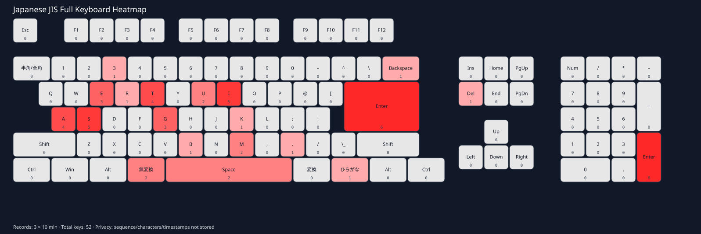

# KeyCounter

Privacy-preserving Windows keyboard usage counter written in Rust.

## Design

- `keycounter-collector.exe` runs in the interactive user session.
- It installs `WH_KEYBOARD_LL` and increments one in-memory counter per Virtual-Key code.
- It never stores key order, characters, scan-code sequences, or event timestamps.
- Every 10 minutes it sends one aggregate snapshot through a local Windows Named Pipe.
- `keycounter-service.exe` receives the snapshot and appends it to `keyboard.kbd`.
- The collector resets counters only after the service acknowledges the record. If IPC fails, the snapshot is merged back into memory.

## Build

On Windows with the Rust MSVC toolchain:

```powershell
cargo build --release
```

The binaries are under `target\release\`.

## Install

Run PowerShell as Administrator:

```powershell
.\scripts\install.ps1
```

The installer:

1. Copies binaries to `%ProgramFiles%\KeyCounter`.
2. Copies configuration to `%ProgramData%\KeyCounter\config.yaml`.
3. Registers `KeyCounterService` as an automatic Windows service.
4. Registers the collector for interactive logon.
5. Starts the service.

## Configuration

Edit `config/config.yaml` before installation. The default interval is 10 minutes.

The following privacy options are intentionally rejected if set to `true`:

```yaml
privacy:
  record_key_sequence: false
  record_characters: false
  record_timestamps: false
```

## Data format

`keyboard.kbd` is a small binary append-only file:

Header (12 bytes):

- 4 bytes: `KBD1`
- 4 bytes: format version (`u32`, little-endian)
- 4 bytes: key count (`u32`, 256)

Each subsequent record is exactly 1024 bytes:

- 256 × `u32` little-endian counters
- index = Windows Virtual-Key code (0..255)

There are deliberately no timestamps in the record.

## Heatmap renderer

The binary records are intended to be aggregated later by a separate viewer. A renderer can map VK codes to JIS/US key geometry and calculate heat intensity from the accumulated counts.

## Important Windows detail

A Windows service runs outside the interactive user's desktop session. Therefore keyboard capture is intentionally implemented by the separate collector process, while the service only accepts aggregate data over a local Named Pipe.

## Heatmap viewer

The workspace includes `keycounter-viewer`, a dependency-light SVG generator. It reads the `.kbd` binary file and renders a JIS-style keyboard heatmap. By default all 10-minute records in the file are aggregated.

```powershell
cargo run --release -p keycounter-viewer -- data\keyboard.kbd images\heatmap.svg
```

To render one 10-minute record instead of the whole day/file:

```powershell
cargo run --release -p keycounter-viewer -- data\keyboard.kbd images\heatmap.svg --record 3
```

Open `heatmap.svg` in a browser. The viewer does not run as a resident process and does not collect keyboard input.


